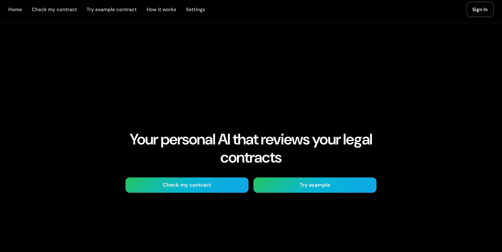
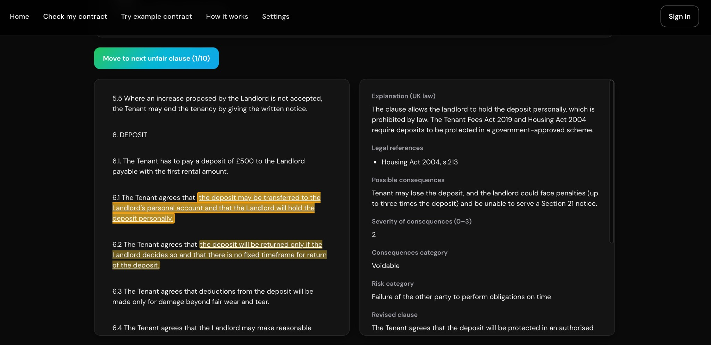

# Contract Red-Flag Detector

Your personal AI that reviews legal contracts and highlights potentially unfair or unlawful terms. Upload a PDF, get a clear report with explanations, legal references, and suggested revisions.

---

## What it does

- **Finds problematic clauses** — Identifies terms that may be unfair, illegal, or risky under the chosen legal framework (e.g. UK residential tenancy).
- **Explains why** — For each finding: explanation, legal references, possible consequences, and severity.
- **Shows exact quotes** — Highlights the relevant text in the contract and lets you move through findings one by one.
- **Suggests fixes** — Proposes revised wording for flagged clauses.
- **Annotated PDF** — Download the contract with findings highlighted.

---

**Home — upload a contract or try an example**



**Results — review each unfair clause with explanation and legal context**



---

## Quick start

### 1. Get the code

```bash
git clone <your-repo-url>
cd legal_contracts
```

### 2. Add your API key

```bash
cp env.example .env
```

Edit `.env` and set **one** of:

- `NEBIUS_API_KEY=your_key_here` (Nebius AI / TokenFactory)
- `OPENAI_API_KEY=your_key_here` (OpenAI or any OpenAI-compatible API)

Optionally set `NEBIUS_BASE_URL` if you use Nebius (default is already set).

### 3. Run with Docker (recommended)

```bash
docker compose up -d --build
```

Open **http://localhost:8000** in your browser.

### 4. Use the app

- **Try example** — Run analysis on a sample contract (no upload).
- **Check my contract** — Upload a PDF **or** paste/type your contract text. If both a file and text are provided, the PDF is used.

Processing usually takes a few minutes. When it’s done, use “Move to next unfair clause” to step through each finding and read the explanation, legal references, and revised clause.

**Stop the server:**

```bash
docker compose down
```

---

## Run without Docker

1. **Python 3.11+** and dependencies:

   ```bash
   python3 -m venv .venv
   source .venv/bin/activate   # or: .venv\Scripts\activate on Windows
   pip install -r requirements.txt
   ```

2. **Environment** — Same as above: copy `env.example` to `.env` and add your API key.

3. **Directories:**

   ```bash
   mkdir -p data/uploads data/results configs
   ```

4. **Start server:**

   ```bash
   uvicorn app.main:app --host 0.0.0.0 --port 8000
   ```

Then open http://localhost:8000.

---

## Sharing your server (optional)

To give others a link to your running app (e.g. for demos), you can use [Cloudflare Tunnel](https://developers.cloudflare.com/cloudflare-one/connections/connect-apps/):

```bash
# With the app already running on port 8000
cloudflared tunnel --url http://localhost:8000
```

Use the generated `https://....trycloudflare.com` URL. No account needed.

---

## Troubleshooting

| Issue | What to do |
|-------|------------|
| “API key is required” | Set `NEBIUS_API_KEY` or `OPENAI_API_KEY` in `.env` and restart. |
| Port 8000 in use | Change the host port in `docker-compose.yml` (e.g. `8080:8000`) or stop the process using 8000. |
| No findings | The contract may have no flagged clauses, or the model may need a different prompt; check Settings and try the example contract. |
| Slow runs | Analysis depends on contract length and API latency; the UI shows an estimated time (e.g. “nearly N minutes”). |

---

## More information

- **Prompts and behaviour** — See [PROMPTS_README.md](PROMPTS_README.md) for editing prompts and few-shot examples.
- **UK legal references** — Valid statutes are in `app/validate_legal_refs.py`. Regenerate a list with `python scripts/update_uk_tenancy_statutes.py` and copy into that file if needed.

---

## Advanced settings

Only change these if you need to tune behaviour. Defaults are fine for normal use.

**In `.env`:**

- **Auth** — `ENABLE_AUTH=1`, `BASIC_AUTH_USER`, `BASIC_AUTH_PASS` to protect the app with a password.
- **Limits** — `MAX_FILE_MB=15`, `TTL_HOURS=24` (how long results are kept).
- **Models** — `OPENAI_MODEL_STAGE1`, `OPENAI_MODEL_STAGE2` (must be valid for your API). Defaults are for Nebius TokenFactory.
- **Behaviour** — `LLM_TEMPERATURE=0.0` (deterministic), `LLM_SEED` (optional), `MAX_LLM_CONCURRENCY=12`.

**Stage 1 (router):**  
`STAGE1_MAX_CATEGORIES`, `T_ROUTER`, `ROUTER_TOPK_PROBS`, `STAGE1_CONTEXT_PARAGRAPHS`, `STAGE1_MAX_INPUT_CHARS`, `STAGE1_OVERLAP_FRAC`, `STAGE1_WINDOW_TOKENS`, `STAGE1_STRIDE_TOKENS`.

**Stage 2 (classifier):**  
`STAGE2_CONTEXT_PARAGRAPHS`, `STAGE2_MAX_CONTEXT_CHARS`.

**Few-shot:**  
`ENABLE_FEWSHOT`, `FEWSHOT_MAX_PER_CATEGORY`, `FEWSHOT_CONTEXT_WINDOW`.

**Network:**  
`HTTP_PROXY`, `HTTPS_PROXY` if you need a proxy.

Change `.env` and restart the app (e.g. `docker compose restart`) for settings to apply.
